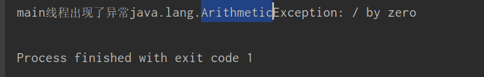

# 线程组和未处理的异常

Java使用ThreadGroup来表示线程组，它可以对一批线程进行分类管理。对线程组的控制相当于同时控制这批线程，用户创建的所有线程都属于指定线程组，如果程序没有显式指定线程属于哪个线程组，则该线程属于默认线程组。默认情况下，子线程属于父线程所在的线程组。

**一旦某个线程加入了指定线程组后，该线程将一直属于该线程组，直到该线程死亡，线程运行过程中不允许更改线程组。**

Thread类提供了几个构造器来设置新创建的线程属于哪个线程组。

- Thread(ThreadGroup group, Runnable target)：以target的run方法作为线程执行体创建新线程，属于group线程组
- Thread(ThreadGroup group, Runnable target, String name)：以target的run方法作为线程执行体创建新线程，该线程属于group线程组，且线程名为name
- Thread(ThreadGroup group, String name)：创建新线程，线程名为name，线程组为group

 此外，Thread类提供了getThreadGroup()方法来获得线程所在线程组。

ThreadGroup类提供了两个构造器：

- ThreadGroup(String name)：以指定线程组名字来创建新的线程组名称
- ThreadGroup(ThreadGroup parent, String name)：以指定的名字、指定的父线程组创建一个线程组

线程组总会有一个字符串类型的名字，该名字可通过ThreadGroup类的getName方法获得，但不允许更改名字。

ThreadGroup类提供了几个常用方法来操作整个线程组里的所有线程

- int activeCount()：返回该线程组所有活动线程的数目
- interrupt()：中断此线程组的所有线程
- isDaemon()：判断该线程组是否为后台线程组
- setDaemon()：把该线程组设置为后台线程组，后台线程组有一个特征：当后台线程组的最后一个线程执行结束或者被销毁后，后台线程组将自动销毁
- setPriority(int pri)：设置线程组的最高优先级


例子：

```java
package work;


public class Main {


    public static void main(String[] args) throws Exception{

        //获得默认线程组也就是主线程所在线程组
        ThreadGroup mainGroup = Thread.currentThread().getThreadGroup();

        System.out.println("主线程组的名字为：" + mainGroup.getName());
        System.out.println("主线程组是否为后台线程组：" + mainGroup.isDaemon());
        new MyThread("主线程组的线程").start();
        ThreadGroup tg = new ThreadGroup("新线程组");
        tg.setDaemon(true);
        System.out.println("tg线程组是否为后台线程组：" + tg.isDaemon());
        MyThread tt = new MyThread("tg组的线程甲");
        tt.start();
        new MyThread(tg, "tg组的线程乙").start();


    }

}

class MyThread extends Thread {

    public MyThread(String name) {

        super(name);
    }

    public MyThread(ThreadGroup group, String name) {

        super(group, name);
    }

    @Override
    public void run() {

        for(int i = 0; i < 20; i++) {
            System.out.println(getName() + "线程的i变量" + i);
        }
    }
}


```


ThreadGroup线程组还定义了一个方法：void uncaughtException(Thread t, Throwable e)：可以处理该线程组内的任意线程所抛出的未处理异常。

从Java 5开始，Java加强了线程的异常处理，如果线程执行过程中抛出了一个未处理异常，JVM在结束该线程之前，会自动查找是否有对应的Thread.UncaughtExceptionHandler对象，如果找到该处理器对象，则会调用该对象uncaughtException(Thread t, Throwable e)方法来处理该异常

Thread.uncaughtExceptionHandler是Thread类的一个静态内部接口，该接口内只有一个方法：void uncaughtException(Thread t, Throwable e)，方法中t代表出现异常的线程，而e代表该线程抛出的异常。

Thread类提供了两个方法来设置异常处理器

- static setDefaultUncaughtExceptionHandler(Thread.UncaughtExceptionHandler eh)：为该线程类的所有实例线程设置默认的异常处理器
- setUncaughtExceptionHandler(Thread.UncaughtExceptionHandler eh)：为指定线程实例设置异常处理器

ThreadGroup类实现了Thread.UncaughtExceptionHandler接口，所以每个线程所属的线程组将会作为默认的异常处理器。

**当一个线程抛出未处理异常时，JVM会首先查找该异常对应的异常处理器(即使用setUncaughtExceptionHandler设置的异常处理器)，进行异常处理，如果没找到，JVM会调用该线程所属的线程组对象的uncaughtException()方法来处理该异常,线程组处理异常的流程为：**

1. 如果该线程组有父线程组，则调用父线程的uncaughtException()方法处理
2. 如果该线程实例所属线程类由默认异常处理器(由setDefaultUncaughtExceptionHandler设置的异常处理器)，那么就调用该异常处理器来处理
3. 如果该异常对象是ThreadDeath的对象，则不做任何处理，否则将异常跟踪栈打印到System.err错误输出流，并结束该线程。

例子：

```
package work;


public class Main {


    public static void main(String[] args) throws Exception{

			//设置当前线程的异常处理器对象
            Thread.currentThread().setUncaughtExceptionHandler(new MyExHandler());

            int a = 5 / 0;
            System.out.println("程序正常结束");


    }

}


class MyExHandler implements Thread.UncaughtExceptionHandler {

    @Override
    public void uncaughtException(Thread t, Throwable e) {
        System.out.println(t.getName() + "线程出现了异常" + e);
    }
}


```

运行结果：

