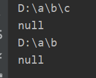

# File类


File类代表与平台无关的文件和**目录**， File可以操作文件和目录，如新建、创建和重命名目录，但是File不能访问文件内容，要想访问文件内容，需要输入输出流。


## 访问文件和目录

File类可以使用文件路径字符串创建File实例，字符串既可以是相对路径，也可以是绝对路径。在默认情况，系统依据用户工作路径解释相对路径，这个路径由系统属性“user.dir”指定，通常就是运行Java虚拟机所在的路径。

#### 解释

绝对路径：盘符开头的路径，表示是一个绝对路径，如"C:/download/a.txt"

相对路径： 相对路径就是指由这个文件所在的路径引起的跟其它文件（或文件夹）的路径关系。
			

---

"./"：代表当前目录。

"../"：代表父目录。


注：在Java源文件用相对路径，默认是工作空间所在目录。


1. 访问文件名相关方法：

     

    **String getName()**

    功能：返回此File对象表示的文件名或路径名(如果是路径，只返回最后一级目录名)

    参数：无

    返回值：字符串

    例子：

    ```java
            File file = new File("D:/a/b/c/test.txt");
            File dir = new File("D:/a/b/c");
            System.out.println(file.getName());
            System.out.println(dir.getName());
    ```

    输出：

    

    ---

    **String getPath()**

    功能：返回File对象对应的路径名。

    参数：无

    返回值：路径名字符串

    **注意**：

    若File对象使用绝对路径构造的，则返回的是绝对路径，若用相对路径构造的，则返回的是相对路径

    例子：

    ```java
            File file = new File("D:/a/b/c/test.txt");
            File file1 = new File("a.txt");
            System.out.println(file.getPath());
            System.out.println(file1.getPath());
    ```

    输出：

    

    ---

    **File getAbsoluteFile()**

    功能：返回此对象的绝对路径。

    参数：无

    返回值：返回用此File对象绝对路径构造的File对象。

    ---

    **String getAbsolutePath()**

    功能：返回此File对象的绝对路径**名**。

    参数：无

    返回值：返回此File对象的绝对路径名字符串。

    **注意**：

    打印同一个对象使用该方法和上述方法，输出都是一样的，但是该方法返回的只是绝对路径名字构成的字符串，

    ---

    **String getParent()**

    功能：返回此对象对应目录的父目录名。

    参数：无

    返回值：父目录名构成的字符串

    **注意**

    1. 若File对象是文件，则返回该文件所在目录，若File是路径，则返回该目录上一级目录。

    2. 如果File对象是以相对路径构造的，则用该方法返回的是null，即没有父目录。
    3. 如果File对象是用绝对路径，则返回绝对路径。

    例子：

    ```java
            File file = new File("D:/a/b/c/test.txt");
            File file1 = new File("a.txt");
            File dir = new File("D:/a/b/c");
            File dir1 = new File(".");
            System.out.println(file.getParent());
            System.out.println(file1.getParent());
            System.out.println(dir.getParent());
            System.out.println(dir1.getParent());
    ```

    输出：

    

    ---

    **boolean renameTo(File newName)**

    功能：重命名File对象对应的文件或者目录

    参数：新名字字符串构成的File对象

    返回值：

    如果重命名成功，返回true，否则返回false

    **注意**

    只可以该最后一级文件或者目录。

    其实前面几级也可以改，但会出现错误的情况，所以用就只改最后一级目录。

    ---

    

    

    

2. 文件检测相关方法：

    

    ----

    **boolean exists()**

    功能：判断File对象对应文件目录是否存在

    参数：无

    返回值：

    存在返回true，否则false

    ---

    **boolean canWrite()**

    功能：判断File对象对应文件或目录是否可写

    参数：无

    返回值：

    可写返回true，否则false

    ---

    **boolean canRead()**

    功能：判断对应文件或目录是否可读

    参数：无

    返回值：

    可读返回true，否则false

    ---

    **boolean isFile()**

    功能：判断File对象对应的是否为文件

    参数：无

    返回值：

    是文件返回true，否则false

    ---

    **boolean isDirectory()**

    功能：判断是否为目录

    参数：无

    返回值：

    是目录返回true，否则false

    ---

    **boolean isAbsolute()**

    功能：判断File对象是否为绝对路径，该方法消除了不同平台差异。

    参数：无

    返回值：

    是绝对路径返回true，否则返回false

    **注意**

    在UNIX/Linux系统上，绝对路径开头是一条斜线/，在Windows系统上，绝对路径开头是盘符，C盘D盘等等。

    ---

     

     

     

3. 获取常规文件信息方法：

    

    **long lastModified()**

    功能：返回文件最后修改时间

    参数：无

    返回值：

    时间构成的long型整数

    ---

    **long length()**

    功能：返回文件内容长度，以字节为单位。

    参数：无

    返回值：

    文件内容长度构成的long型整数

    ---

    

     

     

     

     

4. 文件操作相关方法：

    | 函数原型                                                     | 功能                                                         | 参数                                                         |
    | ------------------------------------------------------------ | ------------------------------------------------------------ | ------------------------------------------------------------ |
    | boolean createNewFile()                                      | 如果File对象对应的文件不存在，<br />则创建一个新文件，<br />创建成功返回ture，<br />否则返回false | 无                                                           |
    | boolean delete()                                             | 删除File对象对应的文件或路径，<br />**如果是路径，则对应路径必须是空目录** | 无                                                           |
    | static File createTempFile(String prefix, String suffix)     | 在默认临时文件目录创建临时文件                               | prefix:给定前缀，至少3字节长<br />suffix:后缀，若null，默认".tmp" |
    | static File createTempFile(String prefix, String suffix, File directory) | 在指定目录创建临时空文件                                     | prefix和suffix同上<br />directory:指定目录                   |

    

    

5. 目录操作相关方法：

     

    **boolean mkdir()**

功能：创建一个File对象对应的**一个**目录，File对象必须是路径。

参数：无

返回值：

若创建成功，返回ture，否则返回false.

**注意**：

该方法只能创建一个，若需要创建多级目录，则会创建失败。

例如 `dir.mkdir()` 其中dir对应目录“D:/a/b/c”，只能创建c目录，若b目录不存在，会创建失败。

---

**boolean medirs()**

功能：创建一个File对象对应的多级目录，File对象必须是路径。

参数：无

返回值：

创建成功返回ture，失败返回false

**注意**：

该方法可以创建多级目录，例如例如 `dir.mkdir()` 其中dir对应目录“D:/a/b/c”，若a目录不存在，则会按照目录关系一级一级创建。

---

**String[] list()**

功能：返回File对象的所有子文件名和目录名，File对象必须是路径。

参数：无

返回值：返回一个String数组。

**注意**：

只会返回本目录所有文件的名字和目录的名字。

---

**File[] listFiles**

功能：列出File对象所有子文件名和目录名，File对象必须是路径。

参数：无

返回值：返回一个包含所有File对象的File数组

**注意**:

若File对象是用绝对路径构造的，则返回的子文件名和目录用getPath()方法返回的是绝对路径
若用的是相对路径，则返回的File对象用getPath()方法返回的是相对路径。

---

**static File[] listRoots()**

功能：列出系统所有的根路径，就是C盘，D盘，静态方法，可用File类直接调用

参数：无

返回值：返回一个包含根路径的File对象数组。

例子：

```java
        File[] a = File.listRoots();

        for(var i = 0; i < a.length; i++)
        {
            System.out.println(a[i].getPath());
        }
```

输出：


​    

​    

​    